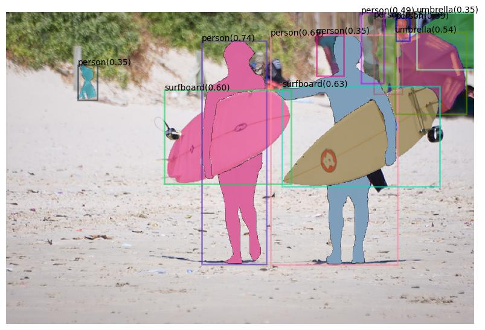

# Label-Anything-Pipeline
> **[Label-Anything-Pipeline](https://github.com/Yuqifan1117/Labal-Anything-Pipeline)**  
> Qifan Yu, Juncheng Li, Siliang Tang, and Yueting Zhuang 

> Zhejiang Univerisity

**This project is under construction and we will have all the code ready soon.**

**GPT-4** can do anything even in visual tasks——Label anything just all in one-pipeline.

## NEWs
**We train the ChatGPT with low-cost and can generate semantically rich prompts for AIGC models creating fantastic images.**

|  Concept / Idea Words   | ChatGPT Prompt Template | AIGC Generated Image | VLM Generated Captions | VFM Automantic Annotations |
|  ----  | ----  | ----  | ----  | ----  |
| Nordic-style decoration room | I want to use artificial intelligence to synthesize the {*Nordic-style decoration room*}. Please describe the features of the {*Nordic-style decoration room*} briefly in English  | | a rendering of a living room with a couch, table, chairs, and a window. | 

Automantic Prompts for AIGC models:
- A room with Nordic-style decoration typically features a clean and minimalist design, with a focus on functionality and simplicity. The color scheme is often light and muted, with shades of white, beige, and gray dominating the palette, creating a sense of calm and tranquility. The furniture is typically made of light-colored wood, with clean lines and simple shapes, and may include iconic Nordic pieces such as a Wegner chair or a Poul Henningsen lamp. Decorative items such as cozy blankets, natural materials like wool or fur, or plants add a touch of warmth and texture to the room. Lighting is often used to create a soft and inviting atmosphere, with natural light streaming in through large windows or artificial light provided by Nordic-inspired fixtures. Overall, a room with Nordic-style decoration creates a sense of simplicity, harmony, and coziness, with a focus on comfort and functionality.

Using stable diffusion to generate and annotate bounding boxes and masks for object detection and segmentation just in one-pipeline! 

**LLM is a data specialist based on AIGC models.**  
1. ChatGPT acts as an educator to guide AIGC models to generate a variety of controllable images in various scenarios
2. Generally, given a raw image from the website or AIGC, SAM generated the masked region for source image and GroundingDINO generated the open-set detection results just in one step. Then, we filter overlap bounding boxes and obtain non-ambiguity annotations.
3. Mixture text prompt and clip model to select the region by similaity scores, which can be finally used to generate the target edited image with stable-diffusion-inpaint pipeline.

## Features
- Highlight features:
  - Pretrained ControlNet with SAM mask as condition enables the image generation with fine-grained control.
  - category-unrelated SAM mask enables more forms of editing and generation.
  - ChatGPT self-chatting enables text guidance-free control for magic image generation in various scenarios.
  - **high-resolution images and high-quality annotations effectively enhance large-scale datasets**.

## Run Demos
- download visual foundation models
```bash
wget https://dl.fbaipublicfiles.com/segment_anything/sam_vit_h_4b8939.pth
wget https://github.com/IDEA-Research/GroundingDINO/releases/download/v0.1.0-alpha2/groundingdino_swinb_cogcoor.pth
```
- load AIGC models for generation
```python
from diffusers import StableDiffusionPipeline
from diffusers import StableDiffusionInpaintPipeline
```
- initialize the annotation pipeline. 
```bash
bash grounded_sam.sh
```
## Generated Cases
### Fantastic Control-Generation by ChatGPT


- **label word:** 

person, beach, surfboard

- **High quality description prompt automatically generated:**

A couple enjoys a relaxing day at the beach with the man walking together with the woman, holding a big surfboard.  The serene scene is complete with the sound of waves and the warm sun and there are many people lying on the beach. 

- **Generated images in magic scenarios:**


  - Specific category of object in an image~(only given 'human face')
  
  
  
  - Total annotations with category sets
  
  

## :bookmark_tabs: Catelog
- [x] ChatGPT chat for AIGC model
- [x] Label segmentation masks and detection bounding boxes
- [x] Annotate segmentation and detection for Conditional Diffusion Demo 
- [x] Using Grounding DINO and Segment Anything for category-specific labelling.
- [ ] Interactive control on different masks for existing image editing and generated image editing.
- [ ] ChatGPT guided Controllable Image Editing.


# Reference 

[1] https://chat.openai.com/

[2] https://github.com/huggingface/diffusers 

[3] https://github.com/facebookresearch/segment-anything

[4] https://github.com/IDEA-Research/Grounded-Segment-Anything/

## 📜 Citation
If you find this work useful for your research, please cite our paper and star our git repo:
```bibtex
@misc{yu2023annotation,
    title = {Label Anything All in One Pipeline},
    author = {Yu, Qifan and Li, Juncheng and Tang, Siliang and Zhuang, Yueting},
    howpublished = {\url{https://github.com/Yuqifan1117/Labal-Anything-Pipeline}},
    year = {2023}
}
```
